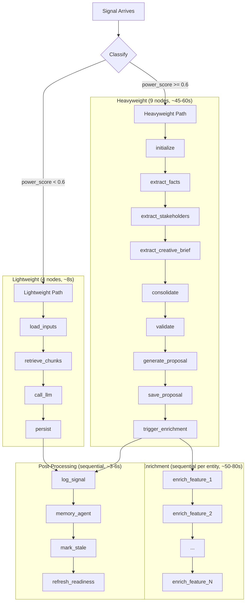
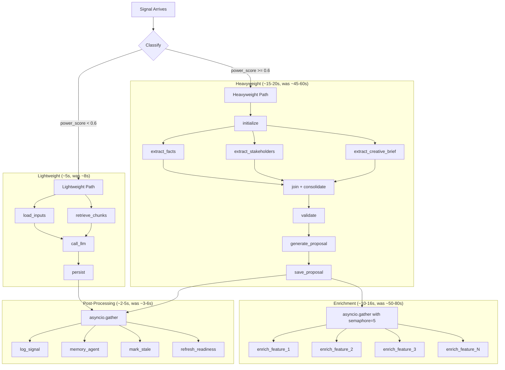
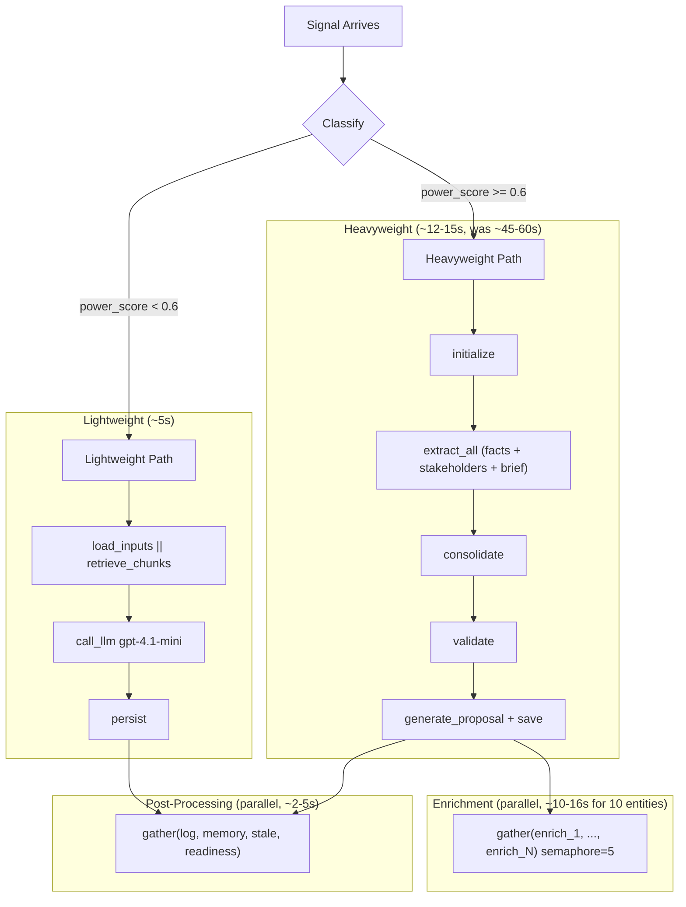

# Signal Processing System Audit

> Generated 2026-02-01 from 6-subagent deep analysis

---

## Quick Wins (< 4 hours each, high impact)

### QW-1: Batch Query Embeddings

**Problem:** `retrieve_project_chunks()` embeds queries one at a time in a loop (5 separate API calls). The same pattern repeats in 5 files.

**Files:**
- `app/core/state_inputs.py:102-106` — 5 sequential `embed_texts([query])` calls
- `app/core/feature_enrich_inputs.py:65`
- `app/core/vp_enrich_inputs.py:67`
- `app/core/persona_enrich_inputs.py:42`
- `app/core/reconcile_inputs.py:149`

**Fix:** Replace `embed_texts([query])` inside the loop with a single `embed_texts(queries)` call before the loop. The OpenAI API already supports batching up to 2,048 texts per request (`embeddings.py:39`).

```python
# Before (5 API calls)
for query in queries:
    query_embeddings = embed_texts([query])
    query_embedding = query_embeddings[0]
    results = search_signal_chunks(query_embedding=query_embedding, ...)

# After (1 API call)
all_embeddings = embed_texts(queries)
for i, query in enumerate(queries):
    results = search_signal_chunks(query_embedding=all_embeddings[i], ...)
```

| Metric | Value |
|--------|-------|
| Speed improvement | ~5x on embedding step (~1-2s saved per call site) |
| Cost reduction | None (same total tokens) |
| Risk | None — `embed_texts` already handles batching internally |

---

### QW-2: Bulk Chunk DB Inserts

**Problem:** After embedding document chunks, individual chunks are inserted into Supabase one at a time in a loop (20+ sequential DB round-trips per document).

**File:** `app/graphs/document_processing_graph.py:347-366`

**Fix:** Replace the per-chunk insert loop with a single batch insert.

```python
# Before (N inserts)
for i, chunk in enumerate(state.chunks):
    chunk_data = { ... }
    supabase.table("signal_chunks").insert(chunk_data).execute()

# After (1 insert)
chunk_records = [{ ... } for i, chunk in enumerate(state.chunks)]
supabase.table("signal_chunks").insert(chunk_records).execute()
```

| Metric | Value |
|--------|-------|
| Speed improvement | ~3-4x on chunk persist step (2-4s → 0.5-1s per document) |
| Cost reduction | None |
| Risk | Very low — Supabase/PostgREST supports bulk insert natively. Batch in groups of 50 for very large documents. |

---

### QW-3: Parallelize Post-Processing Hooks

**Problem:** Four post-processing steps run sequentially after signal processing. They're independent and already individually wrapped in try/except.

**File:** `app/core/signal_pipeline.py:289-330` (duplicated at lines 516 and 665)

**Fix:** Replace sequential awaits with `asyncio.gather`:

```python
# Before
await log_signal_processed(...)           # ~100-200ms
await process_signal_for_memory(...)      # ~2-5s (LLM call)
mark_synthesis_stale(...)                 # ~50-100ms
refresh_cached_readiness(...)             # ~200-500ms

# After
await asyncio.gather(
    log_signal_processed(...),
    _safe_process_memory(project_id, signal_id, ...),
    _safe_mark_stale(project_id),
    _safe_refresh_readiness(project_id),
)
```

| Metric | Value |
|--------|-------|
| Speed improvement | ~1.5x (3-6s → 2-5s, bounded by memory agent LLM call) |
| Cost reduction | None |
| Risk | Very low — all are already "non-fatal" with try/except. Apply across all 3 locations. |

---

### QW-4: Cache `compute_readiness` Per DI Agent Invocation

**Problem:** `compute_readiness` is called 3-6 times per DI Agent cycle, each hitting the DB independently.

**Files:**
- `app/agents/di_agent.py:78` — initial observation
- `app/agents/di_agent.py:278` — post-tool recompute
- `app/agents/di_agent_tools.py:456` — `suggest_discovery_questions`
- `app/agents/di_agent_tools.py:553` — `analyze_gaps`
- `app/agents/di_agent_tools.py:620` — `stop_with_guidance`
- `app/agents/di_agent_tools.py:1073` — `propose_entity_updates`

**Fix:** Compute once at invocation start, pass the result to tools that need it, recompute once after tool execution.

| Metric | Value |
|--------|-------|
| Speed improvement | Eliminates 2-4 redundant DB round-trips per DI Agent call |
| Cost reduction | None |
| Risk | Low — readiness data may be slightly stale for tools that run after entity mutations within the same invocation. Acceptable since the post-execution recompute catches changes. |

---

### QW-5: Deduplicate `extract_strategic_entities_from_signals`

**Problem:** Three DI Agent tools call the exact same function independently. If the LLM calls two of them, the same extraction pipeline runs twice.

**Files:**
- `app/agents/di_agent_tools.py:661` — `extract_business_drivers`
- `app/agents/di_agent_tools.py:783` — `extract_competitors`
- `app/agents/di_agent_tools.py:882` — `extract_stakeholders`

All three call `extract_strategic_entities_from_signals(project_id)`.

**Fix:** Either (a) cache the extraction result for the duration of a DI Agent invocation so subsequent calls return cached results, or (b) collapse into a single `extract_strategic_foundation` tool.

| Metric | Value |
|--------|-------|
| Speed improvement | Eliminates 2x redundant LLM+DB calls when multiple strategic tools are invoked |
| Cost reduction | ~$0.04-0.12 per duplicate call avoided |
| Risk | Low — option (a) requires no API changes; option (b) reduces tool count from 23 to 21 |

---

### QW-6: Fix N+1 in `get_project_source_usage`

**Problem:** For each signal in a project, a separate query fetches its impacts from `signal_impact`. 50 signals = 51 queries.

**File:** `app/db/signals.py:298-307`

**Fix:** Batch-fetch all impacts for the project in one query using `.eq("project_id", str(project_id))` on `signal_impact`, then group by signal_id in Python.

| Metric | Value |
|--------|-------|
| Speed improvement | 101 queries → 2 queries for a 100-signal project |
| Cost reduction | None |
| Risk | None — `signal_impact` already has `project_id` column |

---

## Medium Refactors (1-3 days each, significant impact)

### MR-1: Parallelize Bulk Signal Extraction Agents

**Problem:** The heavyweight signal graph runs 3 extraction nodes sequentially despite zero data dependencies between them.

**File:** `app/graphs/bulk_signal_graph.py:766-769`

```python
# Current: sequential
graph.add_edge("initialize", "extract_facts")
graph.add_edge("extract_facts", "extract_stakeholders")
graph.add_edge("extract_stakeholders", "extract_creative_brief")
```

**Data dependency analysis:**
- `extract_facts` reads: `signal`, `chunks`, `project_id` → writes: `extraction_results`
- `extract_stakeholders` reads: `signal_content`, `signal_type` → writes: `extraction_results`
- `extract_creative_brief` reads: `signal_content`, `project_id` → writes: `creative_brief_result`
- **No cross-node dependencies.** The `extraction_results` list-append is a reducer pattern.

**Fix:** Replace sequential edges with LangGraph fan-out/fan-in. Add `Annotated` reducer for `extraction_results`. Add a lightweight `join_extractions` node before `consolidate`.

| Metric | Value |
|--------|-------|
| Speed improvement | ~3x (15-25s → 5-8s per heavyweight signal) |
| Cost reduction | None (same LLM calls) |
| Risk | Medium — requires LangGraph reducer annotation for shared `extraction_results` list |

---

### MR-2: Eliminate Triple Extraction Redundancy

**Problem:** `extract_facts` already extracts stakeholders and creative brief data, but separate `extract_stakeholders` and `extract_creative_brief` chains re-extract the same data using Claude Sonnet 4.

**Files:**
- `app/chains/extract_facts.py` — extracts facts, stakeholders, client_info
- `app/chains/extract_stakeholders.py` — re-extracts stakeholders from same signal
- `app/chains/extract_creative_brief.py` — re-extracts creative brief from same signal

**Fix:** Extend `extract_facts` output schema to include stakeholders and creative brief fields directly. Remove the redundant extraction chains. Modify the bulk signal graph to use only `extract_facts` for all three extraction tasks.

| Metric | Value |
|--------|-------|
| Speed improvement | ~2x (eliminates 2 of 3 LLM calls) — combines with MR-1 for ~6x total |
| Cost reduction | ~$0.047 per heavyweight signal (~$0.94 per 20-signal engagement) |
| Risk | Medium — need to verify `extract_facts` output quality matches dedicated extractors. May need to enrich the prompt slightly. |

---

### MR-3: Consolidate Vector Search RPC to Single Call

**Problem:** `vector_search_with_priority()` calls the `match_signal_chunks` RPC 4 times (once per status tier + once for legacy) to implement priority boosting. All 4 search the same index with the same embedding.

**File:** `app/db/phase0.py:188-341`

**Fix:** Create a `match_signal_chunks_v2` RPC that returns `confirmation_status` in results. Apply boost multipliers in Python after a single call.

| Metric | Value |
|--------|-------|
| Speed improvement | ~75% latency reduction on vector search (4 RPC calls → 1) |
| Cost reduction | None |
| Risk | Low — requires a new Supabase RPC function (migration) |

---

### MR-4: Parallel Document Queue Processing

**Problem:** Documents are processed one at a time with a 500ms sleep between each. Each document pipeline is completely independent.

**File:** `app/core/document_queue_processor.py:138-157`

**Fix:** Replace sequential `for` loop with `asyncio.gather` bounded by `asyncio.Semaphore(3)`. Remove the 500ms sleep. Pattern already exists in `app/api/business_drivers.py:603-705`.

| Metric | Value |
|--------|-------|
| Speed improvement | ~3x for multi-document uploads (75-150s → 25-50s for 5 docs) |
| Cost reduction | None |
| Risk | Low — atomic claiming already prevents duplicate processing |

---

### MR-5: Fix N+1 in `record_chunk_impacts`

**Problem:** For each chunk_id, two separate queries look up the parent signal and project. 20 chunks = 40 queries.

**File:** `app/db/signals.py:422-450`

**Fix:** Batch-fetch all chunk records with `.in_("id", chunk_ids)`, then batch-fetch distinct signal_ids. Total: 3 queries instead of 2N+1.

| Metric | Value |
|--------|-------|
| Speed improvement | 41 queries → 3 for 20 chunks |
| Cost reduction | None |
| Risk | None |

---

### MR-6: Add Memory Agent Batching/Debouncing

**Problem:** The memory watcher runs on EVERY signal with no debounce/throttle/batching. Processing 10 signals triggers 10 separate watcher LLM calls.

**File:** `app/agents/memory_agent.py:68`

**Fix:** Implement a debounced batch processor: collect signals over a 5-second window, then process them as a batch in a single watcher call.

| Metric | Value |
|--------|-------|
| Speed improvement | N watcher calls → 1 batched call per debounce window |
| Cost reduction | ~$0.009 per batch (N Haiku calls → 1, each ~$0.001) |
| Risk | Medium — need to ensure the watcher prompt handles multi-signal batches |

---

### MR-7: Unify Prep Agent DB Queries

**Problem:** Question Agent, Document Agent, and Agenda Agent each independently query the same tables and each calls `get_state_snapshot(force_refresh=True)`, bypassing the 5-minute cache.

**Files:**
- `app/agents/discovery_prep/question_agent.py:115`
- `app/agents/discovery_prep/document_agent.py:184`
- `app/agents/discovery_prep/agenda_agent.py:96`

**Fix:** Create a single "prep context" function that fetches all needed data once, pass the pre-loaded context to all three agents. Eliminates ~15 redundant DB queries per prep cycle.

| Metric | Value |
|--------|-------|
| Speed improvement | Eliminates ~15 redundant DB queries |
| Cost reduction | None |
| Risk | Low |

---

## Big Bets (1+ weeks, transformative)

### BB-1: Parallel Entity Enrichment

**Problem:** All three enrichment graphs (features, personas, VP steps) loop through entities one at a time, making one LLM call per entity. Each entity is independent.

**Files:**
- `app/graphs/enrich_features_graph.py:221-245`
- `app/graphs/enrich_personas_graph.py:280-295`
- `app/graphs/enrich_vp_graph.py:219-243`

**Fix:** Replace the LangGraph loop with `asyncio.gather` using a semaphore (concurrency=5). Or use LangGraph's `map` pattern for parallel batch processing.

| Metric | Value |
|--------|-------|
| Speed improvement | ~5x for 10 features (50-80s → 10-16s) |
| Cost reduction | None (same LLM calls, just concurrent) |
| Risk | Medium-High — need rate limit management; apply same semaphore pattern from `business_drivers.py` |

---

### BB-2: Migrate DB Layer to Async

**Problem:** All DB modules in `app/db/` use synchronous Supabase client calls. Every database call blocks the FastAPI event loop.

**File:** `app/db/supabase_client.py:11` — uses `create_client()` (sync)

Only `app/db/profiles.py` and `app/db/tasks.py` use async patterns.

**Fix:** Migrate to `create_async_client()` and convert all DB functions to async. This is a codebase-wide change affecting 53 DB modules.

| Metric | Value |
|--------|-------|
| Speed improvement | Unlocks concurrent request handling under load |
| Cost reduction | None |
| Risk | High — touches every DB module, needs careful migration |

---

### BB-3: Transaction Wrapping for Multi-Entity Operations

**Problem:** Critical operations like `persist()` in build_state_graph and `apply_proposal()` write multiple entity types without transactions. If the process crashes mid-write, the database has partial state.

**Files:**
- `app/graphs/build_state_graph.py:316-473` — VP steps, features, personas written separately
- `app/db/proposals.py:290-901` — creates, updates, deletes across 7 entity types
- `app/db/features.py:116-209` — deletes then inserts without transaction

**Fix:** Use Supabase RPC functions for complex multi-entity writes, or use direct PostgreSQL connections with transaction blocks.

| Metric | Value |
|--------|-------|
| Speed improvement | None (may be slightly slower due to transaction overhead) |
| Cost reduction | None |
| Risk | High implementation effort — Supabase REST API doesn't support multi-statement transactions natively |

---

### BB-4: DI Agent Prompt Restructuring

**Problem:** The DI Agent's monolithic 5K-token system prompt + 23 tools (8K+ tokens for tool defs) is loaded regardless of project phase. Memory management (6 tools, 26% of total) dilutes the agent's analytical focus.

**Files:**
- `app/agents/di_agent_prompts.py:11-315` — 305-line system prompt
- `app/agents/di_agent_prompts.py:321-1222` — 23 tool definitions

**Fix:** Phase 1: Load only phase-relevant gate instructions (~1.5-2K token savings). Phase 2: Move memory tools to automatic post-execution hooks. Phase 3: Apply the existing `TokenBudgetManager` from `app/context/token_budget.py`.

| Metric | Value |
|--------|-------|
| Speed improvement | Faster LLM response time from shorter prompts |
| Cost reduction | ~$0.01-0.02 per DI Agent call from reduced input tokens |
| Risk | Medium — need to verify the agent still makes good decisions with fewer instructions |

---

### BB-5: Retire Dual Memory Systems

**Problem:** Both legacy flat memory (`app/db/project_memory.py`) and knowledge graph memory (`app/agents/memory_agent.py` + `app/db/memory_graph.py`) are maintained simultaneously with a fallback mechanism.

**Files:**
- `app/agents/di_agent.py:29` — `USE_KNOWLEDGE_GRAPH_MEMORY = True`
- `app/agents/di_agent.py:96-113` — fallback to legacy if graph fails

**Fix:** Remove the legacy memory path once knowledge graph is validated. Eliminates double-write overhead and simplifies the codebase.

| Metric | Value |
|--------|-------|
| Speed improvement | Eliminates ~50% of memory write overhead |
| Cost reduction | Minor |
| Risk | Low if knowledge graph is stable; needs validation period |

---

## Cost Model

### Current Cost Per Engagement (20 signals)

| Component | Model | Calls | Cost/call | Total |
|-----------|-------|-------|-----------|-------|
| Signal classification | None (regex) | 20 | $0 | $0.00 |
| Lightweight path (build_state) | gpt-4.1-mini | ~14 | $0.015 | $0.21 |
| Heavyweight extraction (facts) | claude-sonnet-4 | ~6 | $0.035 | $0.21 |
| Heavyweight extraction (stakeholders) | claude-sonnet-4 | ~6 | $0.025 | $0.15 |
| Heavyweight extraction (creative brief) | claude-sonnet-4 | ~6 | $0.022 | $0.13 |
| Consolidation | gpt-4o | ~6 | $0.020 | $0.12 |
| Validation | gpt-4o | ~6 | $0.015 | $0.09 |
| Proposal generation | gpt-4o | ~6 | $0.018 | $0.11 |
| Memory watcher | claude-3.5-haiku | 20 | $0.001 | $0.02 |
| Memory synthesizer | claude-sonnet-4 | ~4 | $0.020 | $0.08 |
| Embeddings (OpenAI) | text-embedding-3-small | ~100 | $0.0001 | $0.01 |
| DI Agent (if triggered) | claude-sonnet-4 | ~2 | $0.05 | $0.10 |
| **Total** | | | | **~$1.23** |
| **With enrichment (10 features + 3 personas)** | | | | **+$1.17** |
| **Grand total** | | | | **~$2.40** |

### Projected Cost After Quick Wins + Medium Refactors

| Optimization | Savings |
|-------------|---------|
| MR-2: Eliminate triple extraction | -$0.28/engagement (remove 2 redundant extractors × 6 signals) |
| QW-5: Deduplicate strategic extraction | -$0.08/engagement (prevent double-calling) |
| MR-6: Batch memory watcher | -$0.01/engagement |
| QW-4: Cache compute_readiness | Negligible cost, major speed win |
| BB-4: DI Agent prompt reduction | -$0.02/engagement |

**Projected cost: ~$2.01/engagement (~16% reduction)**

### Projected Cost With Model Downgrades (aggressive)

| Chain | Current Model | Proposed Model | Savings/call |
|-------|--------------|----------------|-------------|
| `extract_stakeholders` | claude-sonnet-4 | gpt-4.1-mini | ~$0.020 |
| `extract_creative_brief` | claude-sonnet-4 | gpt-4.1-mini | ~$0.017 |
| `consolidate` | gpt-4o | gpt-4.1-mini | ~$0.012 |
| `classify_change` | gpt-4o | gpt-4.1-mini | ~$0.008 |
| `extract_claims` | gpt-4o | gpt-4.1-mini | ~$0.010 |

**Projected cost with downgrades: ~$1.40/engagement (~42% reduction)**

> **Caveat:** Model downgrades require quality validation. Run A/B comparison on 50 signals before committing.

---

## Parallel Flow Redesign

### Current Flow: All Sequential



### Proposed Flow: Maximized Parallelism



### Proposed Flow After Triple Extraction Elimination (MR-2)



### End-to-End Timing Comparison

| Phase | Current | After Quick Wins | After All Refactors |
|-------|---------|-----------------|---------------------|
| Lightweight signal | ~8s | ~6s | ~5s |
| Heavyweight signal | ~45-60s | ~35-45s | ~12-15s |
| Post-processing | ~3-6s | ~2-5s | ~2-5s |
| Enrichment (10 features) | ~50-80s | ~50-80s | ~10-16s |
| Document upload (5 docs) | ~75-150s | ~25-50s | ~25-50s |
| **Total heavyweight + enrichment** | **~100-150s** | **~90-130s** | **~25-35s** |

---

## Database Optimization Priorities

### Missing Indexes (add via migration)

```sql
-- P0: Eliminate 4x vector search RPC calls
-- (requires new RPC function match_signal_chunks_v2)

-- P1: N+1 fix support
CREATE INDEX IF NOT EXISTS idx_signal_impact_project_signal
  ON signal_impact(project_id, signal_id);

-- P2: Enrichment queries
CREATE INDEX IF NOT EXISTS idx_features_enrichment_mvp
  ON features(project_id, enrichment_status, is_mvp DESC);
CREATE INDEX IF NOT EXISTS idx_personas_enrichment
  ON personas(project_id, enrichment_status);

-- P3: Search queries (currently full table scans)
CREATE INDEX IF NOT EXISTS idx_document_uploads_filename_trgm
  ON document_uploads USING gin (original_filename gin_trgm_ops);
CREATE INDEX IF NOT EXISTS idx_signals_source_label_trgm
  ON signals USING gin (source_label gin_trgm_ops);

-- P3: Active proposals
CREATE INDEX IF NOT EXISTS idx_batch_proposals_active
  ON batch_proposals(project_id, status, created_at DESC)
  WHERE status IN ('pending', 'previewed');
```

### SELECT * Waste (top offenders)

| File | Table | Fix |
|------|-------|-----|
| `app/db/features.py:94,289,383` | `features` | Select only needed columns — `evidence` and `details` JSONB columns are large |
| `app/db/proposals.py:112,141` | `batch_proposals` | Select only needed columns — `changes` JSONB is very large |
| `app/db/signals.py:28,102` | `signals` | Select only needed columns — `raw_text` is large |

---

## Memory System Issues

| Issue | Severity | File | Fix |
|-------|----------|------|-----|
| Reflector never auto-triggered | HIGH (dead code) | `memory_agent.py:604` | Either wire up auto-triggering or remove |
| Watcher runs per-signal (no batching) | MEDIUM | `memory_agent.py:68` | Add debounce/batch window |
| Synthesizer: 40 DB queries in loop | MEDIUM | Synthesizer prompt builder | Batch-fetch facts, beliefs, edges |
| Memory renderer: 14 queries in loop | MEDIUM | `memory_renderer.py:69-70` | Batch-fetch with single query |
| DI Agent bypasses unified memory cache | MEDIUM | `di_agent.py:96-113` | Use `render_unified_memory()` instead of raw graph render |
| Signal deletion doesn't cascade to memory graph | LOW | `memory_graph.py` | Add cascade delete trigger or cleanup job |
| Dual memory systems maintained | LOW | `di_agent.py:29` | Retire legacy after validation |

---

## Implementation Priority Order

| Order | Item | Category | Speed Impact | Cost Impact |
|-------|------|----------|-------------|-------------|
| 1 | QW-1: Batch embeddings | Quick Win | ~5x on embedding | None |
| 2 | QW-2: Bulk chunk inserts | Quick Win | ~3-4x on persist | None |
| 3 | QW-3: Parallel post-processing | Quick Win | ~1.5x | None |
| 4 | QW-4: Cache compute_readiness | Quick Win | 2-4 fewer DB trips | None |
| 5 | QW-5: Deduplicate strategic extraction | Quick Win | 2x fewer LLM calls | ~$0.08/engagement |
| 6 | QW-6: Fix N+1 source usage | Quick Win | 101→2 queries | None |
| 7 | MR-1: Parallel extraction agents | Medium | ~3x heavyweight | None |
| 8 | MR-2: Eliminate triple extraction | Medium | ~2x heavyweight | ~$0.28/engagement |
| 9 | MR-3: Single vector search RPC | Medium | ~75% search latency | None |
| 10 | MR-4: Parallel document queue | Medium | ~3x doc processing | None |
| 11 | MR-5: Fix N+1 chunk impacts | Medium | 41→3 queries | None |
| 12 | MR-6: Memory agent batching | Medium | N→1 watcher calls | ~$0.01/engagement |
| 13 | BB-1: Parallel enrichment | Big Bet | ~5x enrichment | None |
| 14 | BB-2: Async DB layer | Big Bet | Concurrent throughput | None |
| 15 | BB-3: Transaction wrapping | Big Bet | None (data integrity) | None |
| 16 | BB-4: DI Agent restructuring | Big Bet | Faster LLM response | ~$0.02/engagement |
